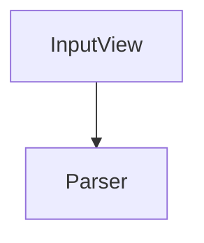

## 클래스 접근 제어자



입력값을 받아 원하는 형태로 파싱하기 위해 Parser라는 클래스를 생성했다. InputView, Parser 모두 view 패키지에 위치하였다.

Parser는 InputView에서만 사용하고 있기에 `package-private`로 변경해도 좋다는 리뷰를 받게 되었고 package-private에 대해 알아보다 아래의 글을 읽게 되었다.

https://hyeon9mak.github.io/Java-dont-use-package-private/

위의 내용을 바탕으로 현업에서는 package-private를 많이 사용하지 않는가에 대해 리뷰어분에게 질문드렸고, 답변받은 내용은 아래와 같다.

```text
실제로 현업에서 코드를 작성할 때 잘 활용하지 않습니다. 그러나 동시에 현업에서 자주 볼 수 있는 접근제어자이기도 합니다.

그 이유는 각종 오픈 소스 라이브러리 및 코드에서 package-private를 자주 볼 수 있는데 그 이유는 패키지 추상화와 관련 있습니다.

객체 역할은 분리되어야 하지만 그것이 외부 모듈(패키지)에서 알 필요가 없는 객체인 경우, package-private로 두어야 유지보수성에 도움이 됩니다.

외부로 나가는 API 및 코드 같은 경우, public으로 노출하면 어쩌면 영원히 유지보수 해야 할 수 있음을 염두에 두어야 합니다.

하지만 사내 코드 같은 경우, 팀원의 코드와 구조에 대해 이해하고 있고 외부 의존성을 고려해야 하지 않는 경우가 대부분이므로 경시되는 건 사실입니다.

그래도 좋은 코드를 위한 제언을 드리자면, 일단 제약을 최대한 걸어두고 필요한 경우 완화를 고려해야 합니다. 자유도가 스파게티 코드로 가는 길이기 때문에 제약사항을 부가하는 것입니다.
```

위의 기준이 무조건 받아드려야 하는 것이 아닌 케이스에 따라 판단 기준이 달라지기 때문에 다양한 선택지에서 나만의 판단 기준을 만들어가도록 꾸준히 연습해나가야 한다. 또한 적용할 때는 이 주제로 남을 설득할 수 있나를 고려해봐야 한다.
