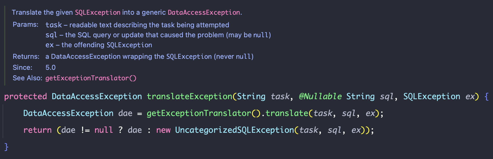

## @Component vs @Repository

`@Repository` 어노테이션은 **Persistence Layer**에 붙이는 어노테이션이다. 해당 어노테이션이 붙은 클래스는 빈으로 등록되어 컴포넌트 스캔이 되고 추가로 데이터 계층에서 발생하는 예외를
스프링에서 처리할 수 있는 예외로 변환하는 작업을 수행한다. 다시 말해서 `PersistenceExceptionTranslationPostProcessor`과 결합하여 스프링의 `DataAccessException`
으로 변환하는 것이다.

예외의 변환을 통해 아래와 같은 이점을 얻을 수 있다.

1. 특정 데이터베이스에 의존적인 예외를 공통으로 처리할 수 있다.
2. 스프링의 계층화된 예외로 인해 상위 또는 하위 타입의 예외를 잡아 처리할 수 있다.

하지만 JdbcTemplate 코드를 확인하면 SQLExceptionTranslator가 SQLException을 DataAccessException으로 변환하고 있는 것을 확인할 수 있다. 그렇다면
`@Repository`를 사용하지 않아도 데이터 계층에서 발생하는 예외를 변환해주는 것일까?

정답을 먼저 말한다면 사용하지 않아도 된다. JdbcTemplate를 사용하는 클래스에서는 @Component를 사용해서 빈으로 등록하더라도 예외 변환이 이루어진다. 하지만 @Component를 사용하면 명시적으로
데이터 계층에 사용되는 빈임을 알려줄 수 없다. 또한 추후에 데이터 계층에 사용되는 기능이 @Repository에 추가되더라도 이를 활용할 수 없다.

따라서 명시적으로 의미를 드러낼 수 있도록 @Repository를 사용하는 것이 좋을 것 같다.
